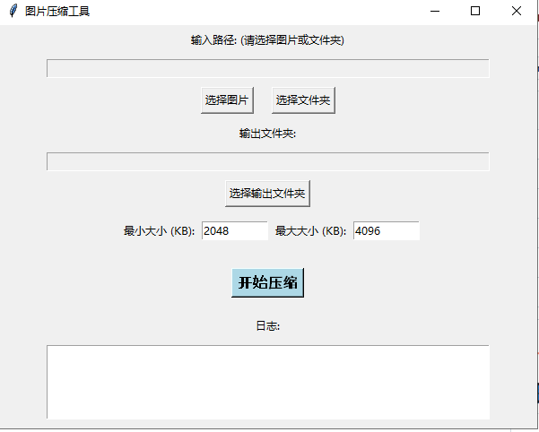

# 图片压缩工具 (Image Compressor GUI)

一款简洁、强大且易于使用的桌面应用程序，专为需要精确控制图片文件大小的用户设计。无论是专业开发者还是日常用户，都能轻松上手。



---

## 🌟 为普通用户准备的快速上手指南

如果您只想快速压缩图片，请遵循以下简单步骤：

1.  **找到并运行程序**:
    - 在项目文件夹中，找到 `dist` 目录，双击运行里面的 `image_compressor_app.exe` 文件。

2.  **选择要压缩的内容**:
    - 点击 **"选择图片"** 按钮，可以挑选单个图片文件。
    - 点击 **"选择文件夹"** 按钮，可以一次性压缩整个文件夹里的所有图片。

3.  **指定保存位置**:
    - 点击 **"选择输出文件夹"** 按钮，告诉程序您想把压缩好的图片存放在哪里。

4.  **设定目标大小 (核心功能)**:
    - 在 **"最小大小 (KB)"** 和 **"最大大小 (KB)"** 输入框中，填入您希望的图片大小范围。例如，如果您希望图片在2MB到4MB之间，就分别填入 `2048` 和 `4096`。

5.  **开始压缩**:
    - 点击大大的 **"开始压缩"** 按钮，程序将自动开始工作。您可以在下方的日志窗口看到实时的进度和结果。

---

## 💻 为开发者准备的技术详解

本项目使用 Python 和 `tkinter` 构建，核心压缩逻辑利用了 `Pillow` 库。

### ✨ 主要特性

- **图形用户界面 (GUI)**: 基于 `tkinter` 构建，无需命令行操作，直观易用。
- **批量处理**: 支持单文件和整个目录的批量压缩。
- **智能质量搜索**: 核心功能。当用户设定目标文件大小范围后，程序会使用**二分查找算法**在 `0-100` 的质量区间内自动搜索最佳的压缩 `quality` 参数，以确保输出文件的大小精确落在目标范围内。
- **高质量输出**: 在压缩JPEG时，默认采用 `4:4:4` 的色度子采样（`subsampling=0`），并关闭了有损的 `optimize` 标志，以在同等文件大小下保留最佳的图像质量。
- **跨线程安全**: 压缩过程在一个独立的线程中运行，避免了在处理大文件时GUI界面卡死的问题，并通过线程安全的方式将日志信息传递回主界面。
- **可作为模块导入**: `imageCompression.py` 脚本经过重构，可以被其他Python程序（如本项目的GUI）作为模块导入并调用其核心功能。

### 🛠️ 环境与依赖

- Python 3.x
- Pillow (`pip install Pillow`)

### 🚀 从命令行运行

您也可以直接通过命令行调用核心脚本 `imageCompression.py`。

**压缩单个图片:**
```bash
python imageCompression.py -i "您图片的完整路径.jpg" --min-size 2048 --max-size 4096
```

**压缩指定目录:**
```bash
python imageCompression.py -d "您文件夹的完整路径" --min-size 2048 --max-size 4096
